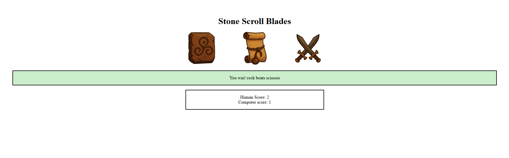

# rock-paper-scissors

A modular, expanded take on the classic Rock–Paper–Scissors game built as part of The Odin Project’s Foundations course.

This implementation focuses on clean JavaScript architecture, simple UI interactions, and a scalable ruleset using circular game logic.
Instead of hard-coded win conditions, the game determines outcomes mathematically — making the system flexible for future expansion.

## Live Demo

[View on GitHub Pages](https://sai-eshwar-supreet.github.io/rock-paper-scissors/)

## Preview

## Features
- Click-based player input using event delegation
- Dynamic scoreboard with real-time updates
- Circular win-logic supporting any odd-number extension (RPS, RPS-5, etc.)
- Simple, visually clean UI layout
- Modular functions and clear separation of concerns

## What I Practiced
- DOM querying and event handling
- Structuring JavaScript into reusable, focused functions
- Implementing circular modulo logic for game mechanics

## Technical Notes
- The game logic uses distance calculation in a circular array to determine winners.
- UI images are mapped directly to game choices for intuitive interaction.

## Attribution
- Images are generated with ChatGPT.